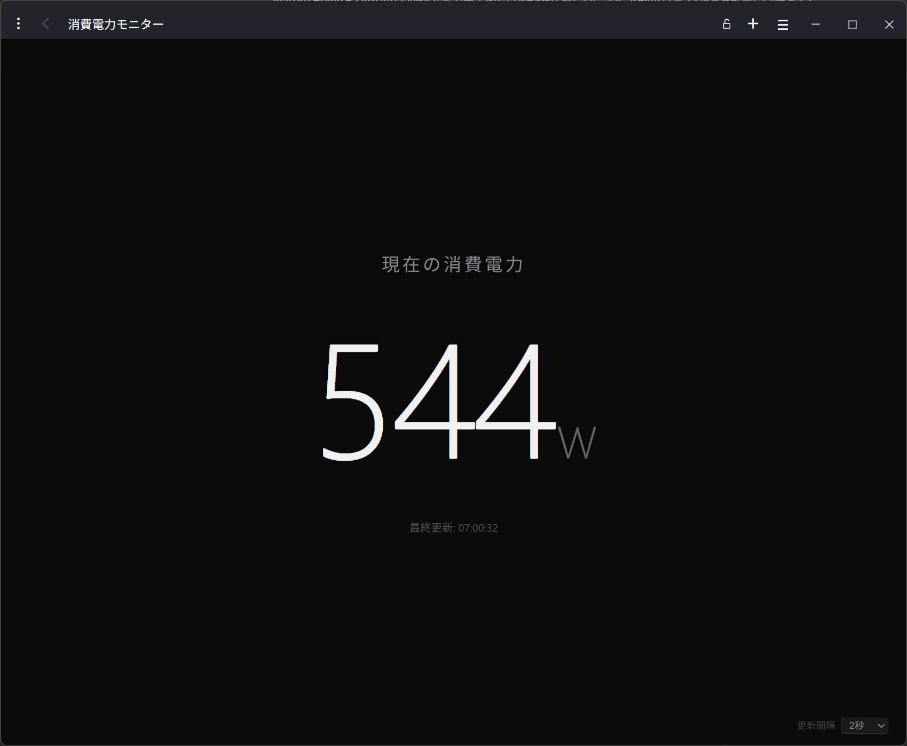

# Nature Remo E2 lite 瞬時電力モニター

Nature Remo E2 lite（スマートメーター連携）から **瞬時電力（W）** を取得し、ブラウザに大きく常時表示するミニマルなダッシュボードです。

- 画面中央に現在の消費電力を大きく表示
- 契約アンペアに基づく使用量警告（赤点滅）
- 電気代・積算量・グラフ等は一切なし — **W だけ**



---

## 必要なもの

| 項目 | 備考 |
|------|------|
| **Node.js** | v20.6 以上（`--env-file` および組み込み `fetch` を使用）。LTS 推奨 |
| **Nature Remo E / E2 lite** | スマートメーターと連携済みであること |
| **API トークン** | Nature Developer で発行（後述） |

## セットアップ

### 1. リポジトリを取得

```bash
git clone https://github.com/Ytz-Ichi/Nature_Remo_E_wattage.git
cd Nature_Remo_E_wattage
```

### 2. 依存パッケージをインストール

```bash
npm install
```

### 3. API トークンを取得

1. [home.nature.global](https://home.nature.global/) にログイン
2. 画面下部の **「Generate access token」** をクリック
3. 発行されたトークンをコピー（**再表示できない**ので必ず控えてください）

### 4. `.env` ファイルを作成してサーバーを起動

`.env.example` を `.env` にコピーし、トークンを設定してください。

```bash
cp .env.example .env
```

`.env` を編集して `NATURE_REMO_TOKEN` にトークンを貼り付けます。

```
NATURE_REMO_TOKEN=ここにトークンを貼り付け
```

サーバーを起動します。`npm start` で `.env` が自動的に読み込まれます。

```bash
npm start
```

> `.env` は `.gitignore` に含まれているため Git にはコミットされません。

### 5. ブラウザで表示

```
http://localhost:3210
```

---

## オプション設定

### 契約アンペア警告 (`CONTRACT_AMP`)

瞬時電力が **契約アンペア × 100 × 0.85 (W)** を超えると、画面が **赤色で点滅** して警告します。

| CONTRACT_AMP | 警告閾値 |
|:---:|:---:|
| 30A（デフォルト） | 2,550 W |
| 40A | 3,400 W |
| 50A | 4,250 W |
| 60A | 5,100 W |

`.env` に以下を追加します。

```
CONTRACT_AMP=40
```

`CONTRACT_AMP` が未設定・空・不正値の場合は **30A** が使われます。

### ポート番号 (`PORT`)

デフォルトは `3210` です。

`.env` に以下を追加します。

```
PORT=8080
```

### 更新間隔

画面右下のセレクトボックスから **5秒 / 10秒（デフォルト） / 20秒 / 30秒** を選択できます。

---

## API レート制限について

Nature Remo Cloud API には **30回 / 5分** のレート制限（デフォルト）があります。

- 本アプリはこの制限を考慮し、**デフォルトの更新間隔を 10秒** に設定しています（5分間で最大 30回）。
- 更新間隔を **5秒以下** にするとレート制限（HTTP 429）に達する可能性があります。
- 429 が返された場合、画面に **「レート制限」と復帰予定時刻**（`X-Rate-Limit-Reset` ヘッダから算出）を表示します。復帰時刻まで自動的にポーリングを一時停止し、時刻経過後に再開します。
- Nature 社に連絡すればレート制限の緩和を依頼できる場合がありますが、緩和が保証されるものではありません。

---

## ファイル構成

```
Nature_Remo_E_wattage/
├── server.js            # Express バックエンド（API プロキシ + /config）
├── public/
│   ├── index.html       # フロントエンド（電力表示 UI）
│   └── screenshot.png   # README 用スクリーンショット
├── package.json
├── .env.example         # 環境変数のテンプレート
├── .gitignore
└── README.md
```

## セキュリティ

- API トークンは **バックエンド（server.js）内でのみ使用** し、フロントエンドやブラウザには一切露出しません。
- `.env` は `.gitignore` で除外されています。**トークンを含むファイルを Git にコミットしないでください。**

## 免責事項

- 本ツールは **無保証** で提供されます。利用は **自己責任** でお願いします。
- 本ツールの使用によって生じた損害について、作者は一切の責任を負いません。
- Nature Remo Cloud API の利用にあたっては、[Nature の利用規約](https://nature.global/legal/terms-of-service/)およびガイドラインに従ってください。
- API のレート制限・仕様変更等は Nature 社の判断により予告なく変更される場合があります。

## ライセンス

MIT
